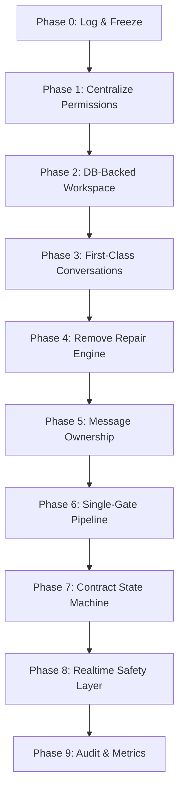

# 🗺️ WorkedIn TN — MASTER BUG FIXING ROADMAP & GUIDE

> [!IMPORTANT]
> **SINGLE SOURCE OF TRUTH FOR AGENTS SOLVING `rapport_for_things_we_need_to_fix.md` BUGS**
> This document defines the exact execution sequence, file mutation paths, and safety guardrails for the refactoring process. Any agent implementing these bug fixes **MUST NOT** deviate from the defined phases or perform unguided exploration.

---

## 🚀 0. SESSION BOOT SEQUENCE (FOR REF-AGENT)

When beginning work on any phase, the agent **MUST ONLY** execute the following sequence:

1. **READ SECURITY ANCHORS FIRST**
   * [AuthContext.tsx](file:///c:/Users/pc/Desktop/workedin_tn/src/contexts/AuthContext.tsx)
   * [workspaceState.ts](file:///c:/Users/pc/Desktop/workedin_tn/src/lib/workspaceState.ts)
   * [workspaceRoutes.ts](file:///c:/Users/pc/Desktop/workedin_tn/src/lib/workspaceRoutes.ts)
   * [ProtectedRoute.tsx](file:///c:/Users/pc/Desktop/workedin_tn/src/components/routing/ProtectedRoute.tsx)
   * [contractConversationInbox.ts](file:///c:/Users/pc/Desktop/workedin_tn/src/lib/contractConversationInbox.ts)

2. **DEFINE SCOPE BOUNDARY**
   * Focus only on the active Phase.
   * Do **NOT** modify downstream files until the phase prerequisites are met.

3. **STOP GLOBAL EXPLORATION**
   * ❌ No full folder scans.
   * ❌ No broad codebase search outside the specified "Hot Files" list.
   * ✔ Only trace files directly imported by the active phase targets.

---

## 🤖 1. EXECUTION RULES & SAFETY PROTOCOLS

To prevent breaking existing flows and introducing regressions:

* **NO SILENT REFACTORS**: Never refactor code that is outside the scope of the target phase.
* **RESTORE CACHING**: Maintain existing sessionStorage and Zustand cache strategies unless explicitly directed in the Phase instructions.
* **MINIMUM MUTATION**: Apply the smallest delta possible to correct the architectural flaw.
* **DATABASE FIRST**: Database table structural additions/modifications must be created as SQL migrations inside `supabase/migrations/` before updating frontend services.
* **DOWNWARD MUTATION FLOW**:
  $$\text{Supabase Migration} \rightarrow \text{Service Layer} \rightarrow \text{State Store} \rightarrow \text{UI Component}$$

---

## 🔄 2. MIGRATION PHASES & ROADMAP



### 🟢 PHASE 0: LOGGING & FREEZE
* **Goal**: Capture baseline behavior and prevent silent regressions before making mutations.
* **Hot Files**:
  * [logger.ts](file:///c:/Users/pc/Desktop/workedin_tn/src/lib/logger.ts)
* **Actions**:
  1. Add warning logs when localStorage workspace switches occur.
  2. Implement tracking for calls to `repairContractConversationInboxRows`.
  3. Ensure there are baseline logs for critical workspace state updates.

---

### 🟢 PHASE 1: CENTRALIZE ACCESS GATES (AUTHORIZATION ENGINE)
* **Goal**: Consolidate scattered access-control validations into a single module.
* **New File**:
  * `[NEW]` [permissionEngine.ts](file:///c:/Users/pc/Desktop/workedin_tn/src/lib/permissionEngine.ts)
* **Hot Files to Mutate**:
  * [ProtectedRoute.tsx](file:///c:/Users/pc/Desktop/workedin_tn/src/components/routing/ProtectedRoute.tsx)
  * [contracts.ts](file:///c:/Users/pc/Desktop/workedin_tn/src/services/contracts.ts)
  * [messages.ts](file:///c:/Users/pc/Desktop/workedin_tn/src/services/messages.ts)
* **Instructions**:
  1. Define and export functions:
     * `canAccessContract(userId, contract)`
     * `canAccessMessage(userId, message)`
     * `canSendMessage(userId, conversation)`
     * `resolveWorkspace(profile)`
  2. Remove inline verification logic from pages/services and delegate to [permissionEngine.ts](file:///c:/Users/pc/Desktop/workedin_tn/src/lib/permissionEngine.ts).

---

### 🟢 PHASE 2: DATABASE-BACKED WORKSPACE STATE
* **Goal**: Deprecate localStorage-only workspace switches. Workspace mode becomes a DB-authoritative field.
* **Database Actions**:
  * Add `active_mode` column of type `text` (validated by constraint `'client', 'freelancer'`) to the `profiles` table if not already present.
* **Hot Files to Mutate**:
  * [AuthContext.tsx](file:///c:/Users/pc/Desktop/workedin_tn/src/contexts/AuthContext.tsx)
  * [workspaceState.ts](file:///c:/Users/pc/Desktop/workedin_tn/src/lib/workspaceState.ts)
  * [workspaceRoutes.ts](file:///c:/Users/pc/Desktop/workedin_tn/src/lib/workspaceRoutes.ts)
* **Instructions**:
  1. Modify `setWorkspace` in `workspaceState.ts` to trigger a Supabase update to `profiles.active_mode`.
  2. Update `fetchProfile` in `AuthContext.tsx` to read the active workspace mode directly from the database profile representation.
  3. Update `loadWorkspaceForUser` to fallback to the cached profile value rather than unauthenticated localStorage keys.

---

### 🟡 PHASE 3: CONVERSATIONS AS FIRST-CLASS ENTITIES
* **Goal**: Eliminate derived conversation models. Conversations must exist as real rows in the DB.
* **Database Actions**:
  * Create a SQL migration to ensure a `conversations` table exists with explicit columns:
    * `id (UUID, PK)`
    * `contract_id (UUID, FK, Nullable)`
    * `client_id (UUID, FK)`
    * `freelancer_id (UUID, FK)`
    * `status (text)`
* **Hot Files to Mutate**:
  * [messages.ts](file:///c:/Users/pc/Desktop/workedin_tn/src/services/messages.ts)
  * [contractConversationInbox.ts](file:///c:/Users/pc/Desktop/workedin_tn/src/lib/contractConversationInbox.ts)
* **Instructions**:
  1. Adjust `getOrCreateConversationId` in `messages.ts` to insert explicit rows into the `conversations` table.
  2. Re-wire conversation hooks to query `conversations` directly using RLS instead of reconstructing inbox relations dynamically.

---

### 🟡 PHASE 4: DEPRECATE & REMOVE REPAIR ENGINE
* **Goal**: Eliminate post-facto corrections and self-healing loops.
* **Hot Files to Mutate**:
  * [contractConversationInbox.ts](file:///c:/Users/pc/Desktop/workedin_tn/src/lib/contractConversationInbox.ts)
* **Instructions**:
  1. Remove `repairContractConversationInboxRows` entirely from the codebase.
  2. Delete files or helpers resolving inbox patches (`resolveContractConversationInboxPatch`).
  3. Refactor caller sites in `messages.ts` or inbox listing pages to fetch pre-existing, consistent DB rows.

---

### 🔵 PHASE 5: MESSAGE OWNERSHIP SYSTEM
* **Goal**: Secure message operations by storing explicit sender and owner metadata.
* **Database Actions**:
  * Add RLS policy to the `messages` table:
    * `CREATE POLICY "Only sender can delete their messages" ON messages FOR DELETE USING (auth.uid() = sender_id);`
* **Hot Files to Mutate**:
  * [messages.ts](file:///c:/Users/pc/Desktop/workedin_tn/src/services/messages.ts)
  * [MessageBubble.tsx](file:///c:/Users/pc/Desktop/workedin_tn/src/components/chat/MessageBubble.tsx)
* **Instructions**:
  1. Enforce validation in `deleteMessage` backend/frontend calls.
  2. Add ownership badges or constraints in UI bubbles to disable delete actions for non-owners.

---

### 🔵 PHASE 6: SINGLE PERMISSION PIPELINE
* **Goal**: Establish a unified chain of authorization.
* **Hot Files to Mutate**:
  * [ProtectedRoute.tsx](file:///c:/Users/pc/Desktop/workedin_tn/src/components/routing/ProtectedRoute.tsx)
  * [routes/index.tsx](file:///c:/Users/pc/Desktop/workedin_tn/src/routes/index.tsx)
* **Instructions**:
  1. Clean up `ProtectedRoute` so it only blocks unauthenticated requests.
  2. Move routing authorization logic (onboarding gating, account status checkpoints) out of `ProtectedRoute` and delegate to route definitions and [permissionEngine.ts](file:///c:/Users/pc/Desktop/workedin_tn/src/lib/permissionEngine.ts).

---

### 🔵 PHASE 7: CONTRACT STATE MACHINE
* **Goal**: Standardize contract status transitions and prevent illegal or manual status modifications.
* **Hot Files to Mutate**:
  * [contractWorkflow.ts](file:///c:/Users/pc/Desktop/workedin_tn/src/lib/contractWorkflow.ts)
  * [contracts.ts](file:///c:/Users/pc/Desktop/workedin_tn/src/services/contracts.ts)
* **Instructions**:
  1. Enforce strict transition checking via `canTransitionContractStatus` on contract mutations.
  2. Raise clear errors at service layer if an illegal transition is requested (e.g. going from `pending` straight to `completed` without `active`).

---

### 🟣 PHASE 8: REALTIME DE-DUPLICATION & ORDERING LAYER
* **Goal**: Stabilize chat synchronization and resolve jumbled chat histories.
* **Hot Files to Mutate**:
  * [useRealtimeChat.ts](file:///c:/Users/pc/Desktop/workedin_tn/src/hooks/useRealtimeChat.ts)
  * [messages.ts](file:///c:/Users/pc/Desktop/workedin_tn/src/services/messages.ts)
* **Instructions**:
  1. Implement a client-side de-duplication cache using message IDs.
  2. Sort message updates chronologically using database-generated `created_at` timestamps before injecting them into the Zustand store.

---

### 🟣 PHASE 9: OBSERVABILITY & AUDIT TRAIL
* **Goal**: Record critical transitions and permission violations.
* **Database Actions**:
  * Create a `security_audit_logs` table:
    * `id (UUID, PK)`
    * `user_id (UUID)`
    * `action (text)`
    * `details (jsonb)`
    * `created_at (timestamp)`
* **Hot Files to Mutate**:
  * [permissionEngine.ts](file:///c:/Users/pc/Desktop/workedin_tn/src/lib/permissionEngine.ts)
* **Instructions**:
  1. Log any authorization failure or workspace spoofing attempts into the `security_audit_logs` table.

---

## 🗄️ 3. CORE DATABASE ACTIONS & MIGRATION SQL

When executing phases 2, 3, and 5, run the following SQL queries inside Supabase SQL Editor:

```sql
-- Phase 2: active_mode support
ALTER TABLE profiles 
ADD COLUMN IF NOT EXISTS active_mode text CHECK (active_mode IN ('client', 'freelancer')) DEFAULT 'client';

-- Phase 3: Create explicit conversations table
CREATE TABLE IF NOT EXISTS conversations (
    id UUID PRIMARY KEY DEFAULT gen_random_uuid(),
    contract_id UUID REFERENCES contracts(id) ON DELETE SET NULL,
    client_id UUID NOT NULL REFERENCES profiles(id),
    freelancer_id UUID NOT NULL REFERENCES profiles(id),
    status text DEFAULT 'active',
    created_at TIMESTAMP WITH TIME ZONE DEFAULT timezone('utc'::text, now()) NOT NULL
);

-- RLS Gating for Conversations
ALTER TABLE conversations ENABLE ROW LEVEL SECURITY;

CREATE POLICY "Users can view their own conversations" 
ON conversations FOR SELECT 
USING (auth.uid() = client_id OR auth.uid() = freelancer_id);

-- Phase 5: Message Ownership RLS Policy
ALTER TABLE messages ENABLE ROW LEVEL SECURITY;

CREATE POLICY "Sender can delete their own messages" 
ON messages FOR DELETE 
USING (auth.uid() = sender_id);
```

---

## 🧭 FINAL RULE (ABSOLUTE TRACE BOUNDARY)

> [!WARNING]
> DO NOT touch RLS schemas without validating front-end state synchronization.
> DO NOT bypass the [permissionEngine.ts](file:///c:/Users/pc/Desktop/workedin_tn/src/lib/permissionEngine.ts) once created.
> Follow the sequence phase by phase. Do not skip phases or run them out of order.
